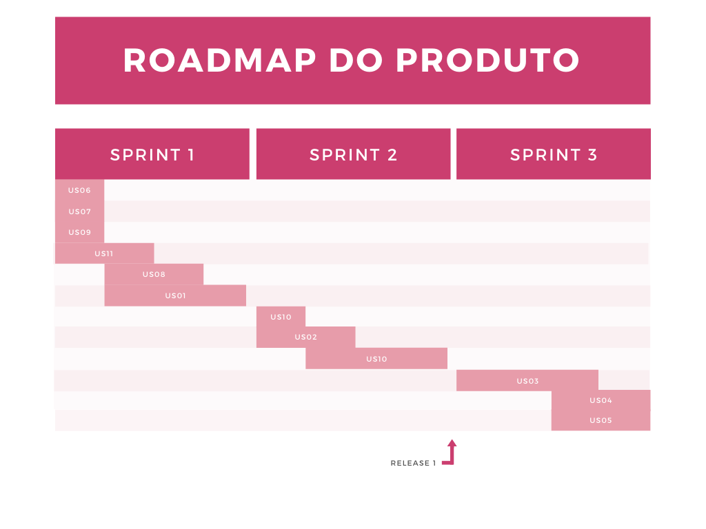

# Histórico de Revisão
| Data   | Versão | Modificação  | Autor  |
| :- | :- | :- | :- |
| 02/05/2020 | 1.0 | Criação do roadmap |  Leonardo Gomes |

## Roadmap do Projeto

O desenvolvimento do projeto foi dividido em 3 sprints:

 - Sprint 1: Criação do ambiente de desenvolvimento, desenvolvimento da página inicial e produção de documentação.
 - Sprint 2: Criação do ambiente de produção e de documentação, finalização dos recursos essenciais.
    - Entrega da release 1.
 - Sprint 3: Desenvolvimento de novas funcionalidades e correção de bugs.

Cada uma dessas Sprints terão a duração de **4 dias**, esse tempo foi extipulado pelo nível e a capacidade de aprendizado da equipe. 

O Roadmap pode ser melhor acompanhado pelo [Kanban do Roadmap do produto](https://github.com/bora-aprender/Frontend/projects/1)

